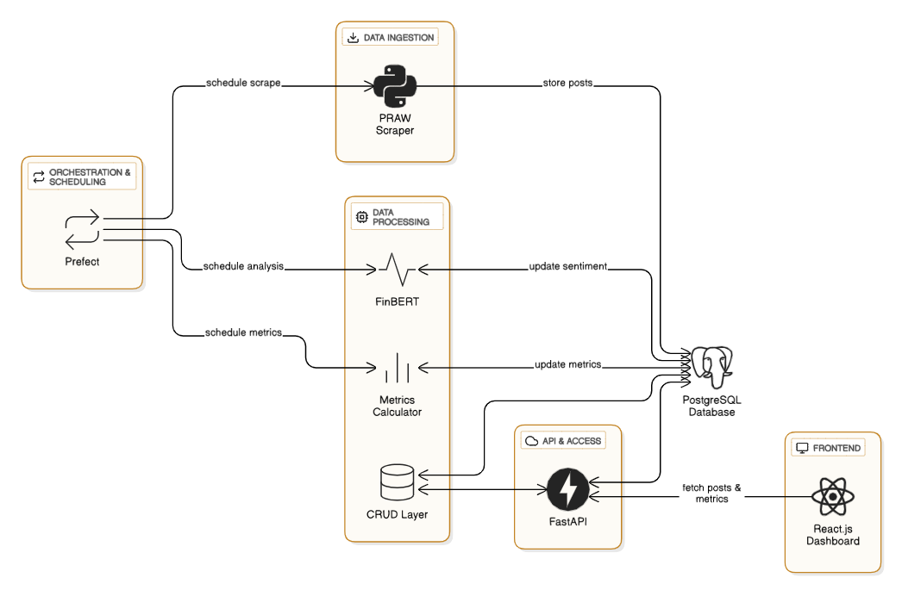

# 📈 Reddit Sentiment Analyzer for Stock Trends

A sentiment analysis system that scrapes Reddit for stock-related posts, classifies them using **FinBERT**, computes sentiment metrics, and visualizes insights like **Buy/Sell/Hold** on a dashboard.  
Built with **FastAPI**, **React.js**, **PostgreSQL**, and **Prefect**.

---

## 🧠 Project Architecture

### 🔹 1. Overview

The system collects daily Reddit posts about stock tickers, analyzes their sentiment using FinBERT, computes metrics, and displays them on a frontend dashboard to help users make informed stock decisions.

---

### 🔹 2. Components

#### 📥 A. Data Ingestion  
- **PRAW** (Reddit API)  
- Scrapes trading subreddits for post content and metadata  
- Stores posts in PostgreSQL

#### 🔍 B. Sentiment Analysis  
- **FinBERT** (financial sentiment classifier)  
- Labels posts as positive / neutral / negative with confidence scores  
- Saves results in the database

#### 📊 C. Metrics Engine  
- **Python + SQLAlchemy**  
- Calculates:
  - Sentiment breakdown
  - Weighted sentiment trend
  - Post spike ratio
  - Avg. Reddit score
  - Buy/Sell/Hold decision (custom logic)

#### 🧩 D. Business Logic (`crud.py`)  
- Deduplication via `reddit_id`  
- CRUD methods for posts and metrics  
- Determines trend direction (rising, falling, stable)

#### 🌐 E. API Layer  
- **FastAPI**  
- Endpoints:
  - `POST /` – Add post (auto-analyzed)
  - `GET /ticker/{ticker}` – Fetch posts
  - `GET /metrics/{ticker}` – Fetch computed metrics

#### 📆 F. Scheduling  
- **Prefect**  
- Automates ETL: Scrape → Analyze → Store → Compute

#### 🖥️ G. Dashboard  
- **React.js**  
- Displays:
  - Sentiment trends and decisions
  - Top Reddit posts per ticker
  - Visual metrics (charts, trends)

---

## 🖼️ Preview

| Dashboard Views | |
|------------------|------------------|
|  |  |

### 🏗️ Architecture Diagram  


---

## ⚙️ Tech Stack

- **Backend**: FastAPI, PRAW, FinBERT, SQLAlchemy, PostgreSQL, Prefect  
- **Frontend**: React.js, TailwindCSS, Axios  
- **Other**: HuggingFace Transformers (FinBERT)

---

## 🚀 Getting Started

### Backend

```bash
cd backend
python -m venv venv
source venv/bin/activate
pip install -r requirements.txt
uvicorn main:app --reload
